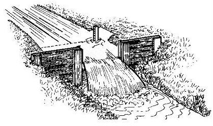
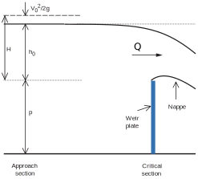
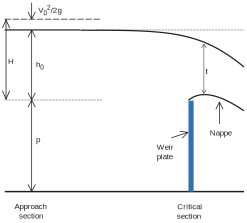
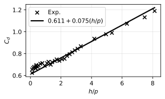

# Models and Approximate Solutions for Open-Channel Flows: Application to a Free Sharp-crested Weir

https://github.com/QuentinMale/sharp-crested-weir

Slide deck available at https://quentinmale.github.io/sharp-crested-weir

---

## Rectangular sharp-crested weir

Application: Irrigation canals & water distribution
- No moving parts
- Converts an easy measurement (water level) into flow rate

---

## Question to answer today

Given a certain water level $h_0$, what is the water flow rate $Q$?

---

## Bernoulli principle (energy budget)

- Inviscid flow (no viscous dissipation)
- Steady flow
- Incompressible fluid

The Bernoulli equation holds along a streamline (everywhere if irrotational):

$$
\boxed{
\underbrace{p/\rho}_{\text{pressure energy}}
+ \underbrace{{v^2}/{2}}_{\text{kinetic energy}}
+ \underbrace{g z}_{\text{potential energy}}
= \text{constant}
}
$$

---

## Weir-discharge equation

- Contraction is neglected
- $V_0 \approx 0$ ($H=h_0=h$)

$$
\boxed{
q^\prime = 2/3 \sqrt{2g} \,h^{3/2}
}
$$
 

$$
q' = Q'/b \quad \text{(ideal discharge per unit width)}
$$

---

## Corrected weir equation

$$
\boxed{
Q = \underbrace{C_d}_\text{discharge coefficient} \, b \, 2/3 \sqrt{2g} \, h^{3/2}
}
$$

Interpretation: $C_d = Q / Q^\prime$ (real/ideal) is a correction factor.
Incorporate: viscous friction losses, upstream velocity head, and contraction.

---

## How is $C_d$ determined?

1. Measure head $h$

2. Measure discharge $Q$

3. Compute $C_d$ from the definition
$$
C_d
= \frac{Q}{\frac{2}{3} b \sqrt{2g}\,h^{3/2}}
$$

4. Repeat for many heads and/or geometries

You now have a set of points and can fit an empirical correlation.

---

## Dimensional analysis (Buckingham $\Pi$ theorem)

$$
\Pi_1=Q/\left(b\sqrt{gh^3}\right) \text{ , } \Pi_2 = h/p \text{ , } \Pi_3 = Re_h = \rho \sqrt{gh^3} / \mu \text{ , } \Pi_4 = We_h = \rho g h^2 / \sigma
$$

At sufficiently large Reynolds number and Weber number:
- $Re_h \gg 1$  $\Rightarrow$ viscous effects are confined to thin boundary layers  
- $We_h \gg 1$  $\Rightarrow$ surface tension effects are negligible

$$
\boxed{
\Pi_1 = \phi \! \left( \Pi_2 \right) \quad
\implies
C_d = \phi \!\left(\frac{h}{p}\right)
}
$$

---

## Discharge coefficient

Linear fit (Kandaswamy & Rouse, 1957): $C_d = 0.611 + 0.075 \, h/p$

---

## Summary (what to remember)

- The ideal derivation gives the scaling: $q^\prime \propto h^{3/2}$.
- Real flows deviate due to **losses + contraction + approach effects**.
- $C_d$ is determined by **calibration**:
  measure $Q$, measure $h$, compute $C_d = Q/Q^\prime$.
- Over practical ranges (high enough $Re_h$), the dominant dependence collapses to
  $C_d = C_d(h/p)$.

---

## Exercise

1. Run the code in the basilisk folder to get $q=f(h/p)$.

2. Fit a linear discharge coefficient law given the data points
   $$
   C_d = c_1 + c_2 \, h/p
   $$

3. Given $h$, find the crest height $p$ to achieve a certain flow rate.
